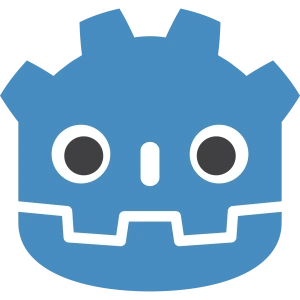
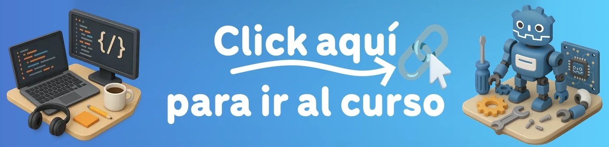
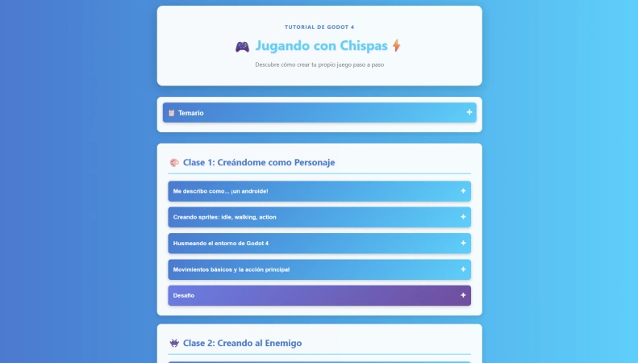
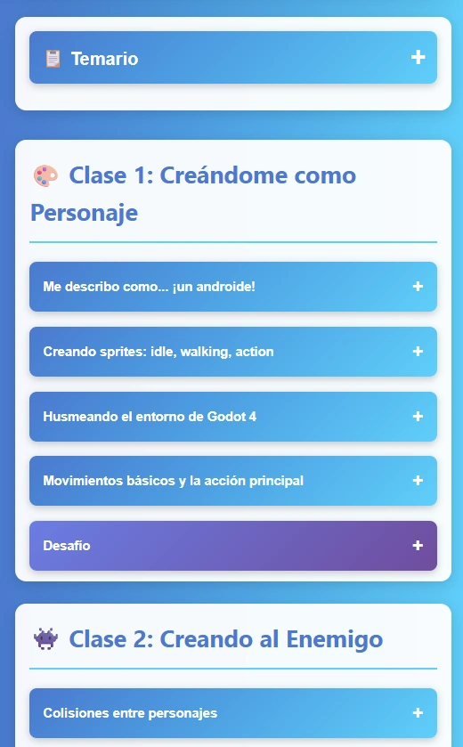
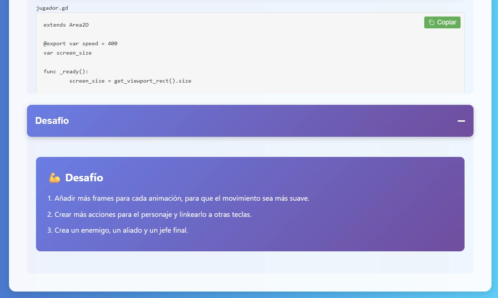

# Intro a Godot 4

¡Crea tu primer juego interactivo con esos simples pasos!

## 📑 Contenidos

- [¿Qué es Intro a Godot 4?](#about)
- [¿Quién creó este repositorio?](#team)
- [Planes a futuro](#future_plans)
- [Instalar el repo](#dev)
- [Uso del sitio](#usage)
- [Tecnologías usadas](#tech_stack)
- [Autor](#authors)
- [Agradecimientos](#acknowledgments)

## 💡 ¿Qué es Intro a Godot 4?  

¿Cuántas veces pensaste en crear un videojuego pero no sabías por dónde empezar? Ya no lo pienses más y aprende lo básico sobre videojuegos con este tutorial interactivo que te permitirá crear tu primer juego en 2D, usando inteligencia artificial para el diseño de tu personaje, y siguiendo ejemplos claros del paso a paso para lograr ejecutarlo en el motor. [¡Click aquí para ir al tutorial!](https://marfullsen.github.io/intro-a-godot/)

## 📖 Fines del proyecto

El proyecto se creó con fines académicos para el _CITT de San Joaquín_, logrando enseñar exitosamente a estudiantes durante el mes de noviembre de 2025, y en un futuro podría llegar a ser implementado en los demás _CITTs_ de las otras sedes de Duoc UC.

## 🧐 ¿Quién creó este repositorio? 

- :man_student: Francisco Marfull - Capitán del taller de videojuegos del CITT de San Joaquín.

## 🏁 Planes a futuro 

Se irán implementando más módulos y funciones al tutorial, entre las cuales se encentran:
- Badges (Se darán medallitas virtuales por cada módulo finalizado)
- Leaderboard (una tabla de los mejores estudiantes que recientemente terminen el curso)
- Nuevos cursos de especialización.
- Y mucho más.

## 📐 Instalando el portal web 

En caso de querer husmear sin descargar el repo, entrar al siguiente link con el proyecto ya en producción mediante Github Pages:
> [marfullsen.github.io/intro-a-godot/](https://marfullsen.github.io/intro-a-godot/)

En caso de querer modificar el repo para añadir o quitar contenido, descargar el repo y seguir las siguientes instrucciones:

El portal web está hecho con HTML puro, por tanto **No necesita instalar ningún framework especial**, sólo con un servidor como LiveServer será suficiente para lanzar la versión web.

### Requisitos Previos

- VS Code o cualquier editor para modificar el código.
- LiveServer o cualquier servidor de desarrollo para ejecutar el proyecto.

Se recomienda tener **VS Code** con alguna extensión de algún servidor web como **LiveServer**, pero las demás opciones también son válidas.

### Configurando la versión para continuar desarrollando  

- Lanza el servidor LiveServer dentro de VS Code.
- Modifica el código.
- y listo, ¡Se debiera ver el portal web modificado en localhost!

## Uso general 

Para uso general simplemente entrar al link y realizar el curso:
> [marfullsen.github.io/intro-a-godot/](https://marfullsen.github.io/intro-a-godot/)

## Capturas de pantalla

### Vista en el navegador de escritorio

Pantalla principal.

  

---

### Vista en celular

Pantalla principal.

  

---

### Vista en tablets

Pantalla principal, se aprecian fragmentos copiables de código y desafíos de cada lección.

  

## ⛏️ Tecnologías usadas 

- Godot Engine 4 - Motor para crear videojuegos en 2D y 3D.
- HTML, CSS, JS - Presentación del contenido de las clases.
- Github pages - Para alojar el sitio web.

## ✍️ Autor 

- :man_student: Francisco Marfull - Estudiante de Ingeniería en Informática.

## 🎉 Agradecimientos, referencias y menciones 

- :man_teacher: Agradecimientos al profesor **Erwin Aguilera Segura** de la sede San Joaquin por permitirme hacer un mes de clases de Godot 4.
- :book: Agradecimientos al _CITT de San Joaquin_ que imparte diferentes talleres para apoyar a los estudiantes a ir más allá de la sala de clasaes.
- 🎮 Agradecimientos a Godot Engine por motivarnos a crear videojuegos.